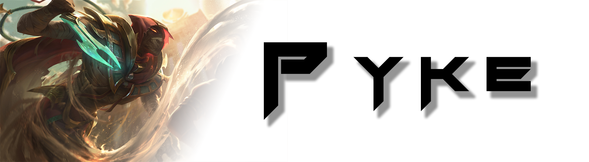

[](https://github.com/wickedlizerd/Pyke/actions?query=workflow%3A%22.NET+Core%22)

A C# Library for interacting with the League of Legends Client LCU.


## Usage Example
This example shows how to hook GameglowState Changes, which we can use to detect if we are in matchmaking, champ select, post-game summary, etc...
```cs
    class Program
    {
        private static LeagueAPI API;
        static void Main(string[] args)
        {
            API = new LeagueAPI().ConnectAsync().GetAwaiter().GetResult();

            API.Events.SubscribeEvent(EventType.GameflowStateChanged);
            API.Events.GameflowStateChanged += Events_GameflowStateChanged;
            Console.ReadLine();
        }

        private static void Events_GameflowStateChanged(object sender, State e)
        {
            Console.WriteLine("State Changed: " + e.ToString());
        }
    }
 ```
 
 ## Libraries Used
 Pyke was made possible using the following libraries
 LCU-Sharp
 Json.NET
